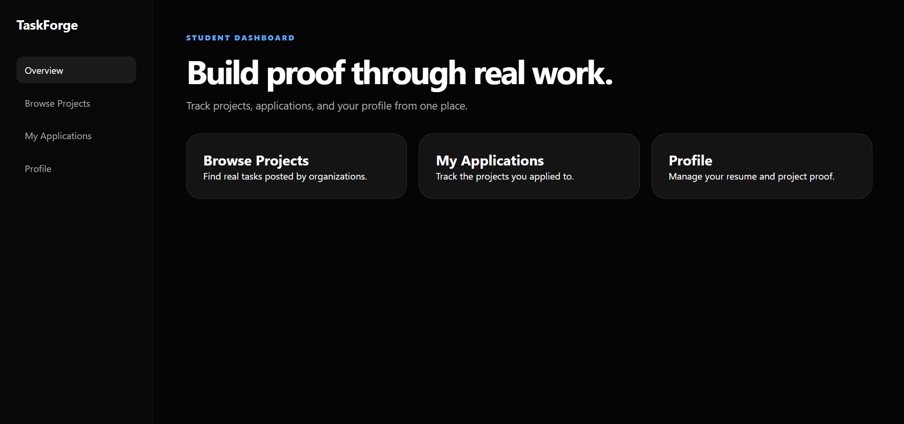
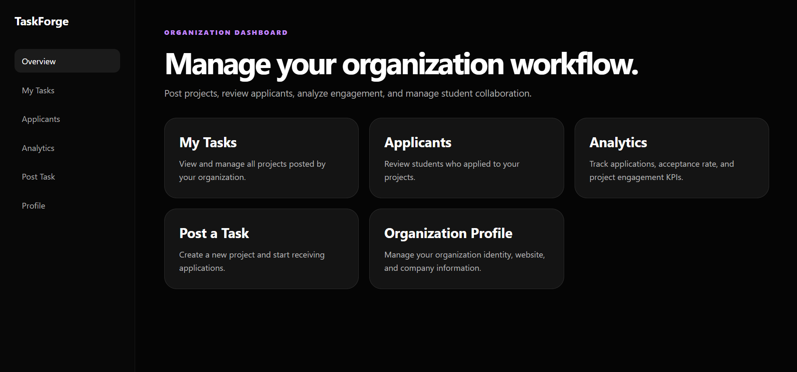
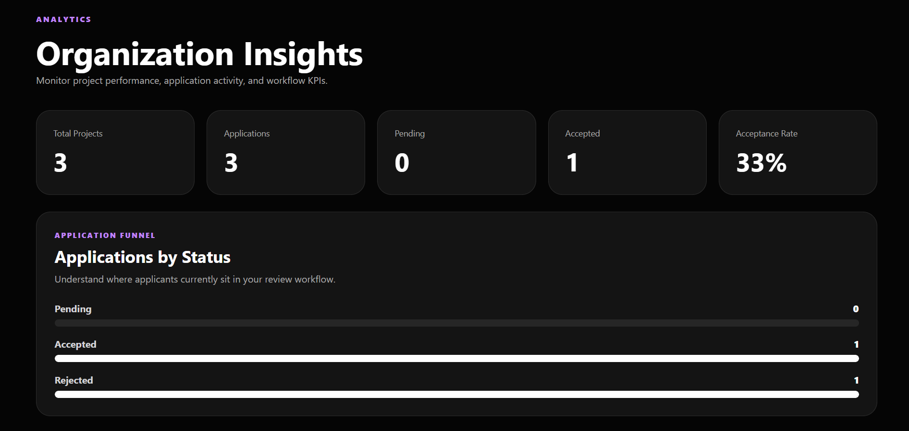

# Indom

A full-stack platform connecting students with organizations through real-world project opportunities.

## Live Demo 

**Live Demo** https://taskforge-puce.vercel.app/

## Project Overview

Indom is a full-stack web application designed to bridge the gap between students seeking hands-on experience and organizations looking for talented individuals to work on real-world projects.

Students can create an account, browse available opportunities, apply to projects, and track their application status. Organizations can securely manage projects, review applicants, update application statuses, and monitor project activity through an analytics dashboard.

This project demonstrates full-stack development, authentication, database management, data visualization, and business analysis documentation.

## Features

### Student Portal

- Secure account registration and login
- Browse available projects
- View project details
- Submit project applications
- Track application status through a dedicated student dashboard

### Organization Portal

- Secure account registration and login
- Dedicated organization dashboard
- Create and manage projects
- Review student applications
- Update application statuses
- View analytics dashboard
- Export applicant data to CSV

### Access Control

- Role-based authentication
- Separate dashboards for students and organizations
- Different features available based on user role


## Tech Stack

| Category | Technology |
|----------|------------|
| Frontend | Next.js, React |
| Language | TypeScript |
| Styling | Tailwind CSS |
| Backend | Supabase |
| Database | PostgreSQL |
| Authentication | Supabase Auth |
| Data Visualization | Recharts |
| Deployment | Vercel |
| Containerization | Docker |
| Version Control | Git & GitHub |


## Project Structure

```text
Indom/
├── app/                 # Application pages, layouts, and routing
├── components/          # Reusable UI components
├── docs/                # Business analysis and project documentation
├── lib/                 # Supabase configuration and shared utilities
├── public/              # Static assets
├── Dockerfile
├── package.json
├── tsconfig.json
└── README.md
```

## Documentation

The `docs/` folder contains project planning and business analysis artifacts, including:

- Business Requirements Document (BRD)
- User Stories
- Use Case Diagram
- Process Flow Diagram
- System Architecture
- User Acceptance Testing (UAT)


## System Architecture

Indom follows a modern full-stack architecture using **Next.js**, **Supabase Auth**, and **PostgreSQL**. The frontend provides separate experiences for students and organizations, while Supabase manages authentication and database operations.

```text
                      Students                    Organizations
                           │                             │
                           └─────────────┬───────────────┘
                                         │
                                         ▼
                           Next.js Web Application
                                         │
          ┌──────────────────────────────┼──────────────────────────────┐
          │                              │                              │
          ▼                              ▼                              ▼
 Authentication                 Project Management            Analytics Dashboard
          │                              │                              │
          └──────────────────────────────┼──────────────────────────────┘
                                         │
                                         ▼
                               Supabase Backend
                                         │
                   ┌─────────────────────┴─────────────────────┐
                   │                                           │
                   ▼                                           ▼
            Supabase Auth                           PostgreSQL Database
                                                           │
                                ┌──────────────────────────┼──────────────────────────┐
                                ▼                          ▼                          ▼
                            User Profiles              Projects                  Applications
                                        │
                                         ▼
                               Deployed on Vercel
```

Students and organizations access the application through a unified Next.js frontend. Authentication is handled by **Supabase Auth**, while **PostgreSQL** stores user profiles, projects, and applications. Business logic coordinates project management and application workflows, and the application is deployed on **Vercel** for hosting.

## Application Screenshots

### Landing Page


---

### Student Dashboard



---

### Organization Dashboard



---

### Analytics Dashboard




## Getting Started

### Prerequisites

- Node.js 18+
- npm
- Supabase account

### Clone the repository

```bash
git clone https://github.com/nikishrajbastola/Indom.git
cd Indom
```

### Install dependencies

```bash
npm install
```

### Configure environment variables

Create a `.env.local` file.

```env
NEXT_PUBLIC_SUPABASE_URL=your_supabase_url
NEXT_PUBLIC_SUPABASE_ANON_KEY=your_supabase_anon_key
```

### Start the development server

```bash
npm run dev
```

Visit:

```
http://localhost:3000
```
